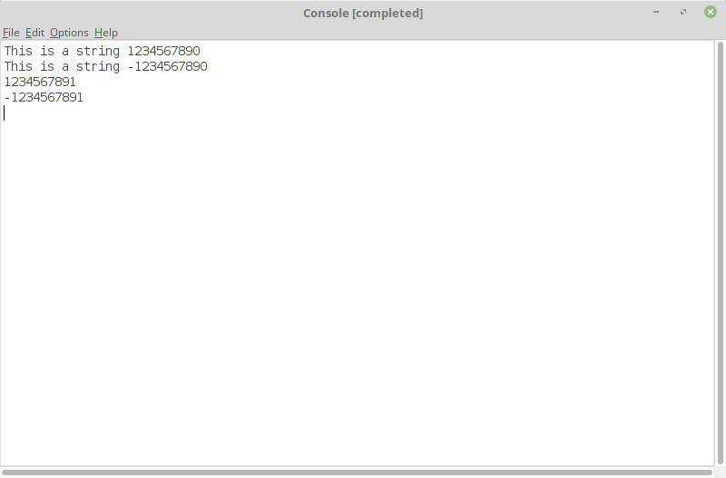

# Stanford CS106B (Spring 12)
My solutions to CS106B (Spring 12) Assignments using Qt Creator & [Stanford C++ Library](https://stanford.edu/~stepp/cppdoc/).

# Outputs

## Assignment 1

  
  <figcaption> Problem 1: Rosencrantz and Guildenstern flip Heads (Chapter 2, exercise 15, page 123)  </figcaption>

  
  <figcaption> Problem 2: Obenglobish (Chapter 3, exercise 16, page 152)  </figcaption>

  
  <figcaption> Problem 3: Combinations and Pascal's Triangle (Chapter 7, exercise 9, page 349)  </figcaption>

  
  <figcaption> Problem 4: Implementing Numeric Conversions  </figcaption>

